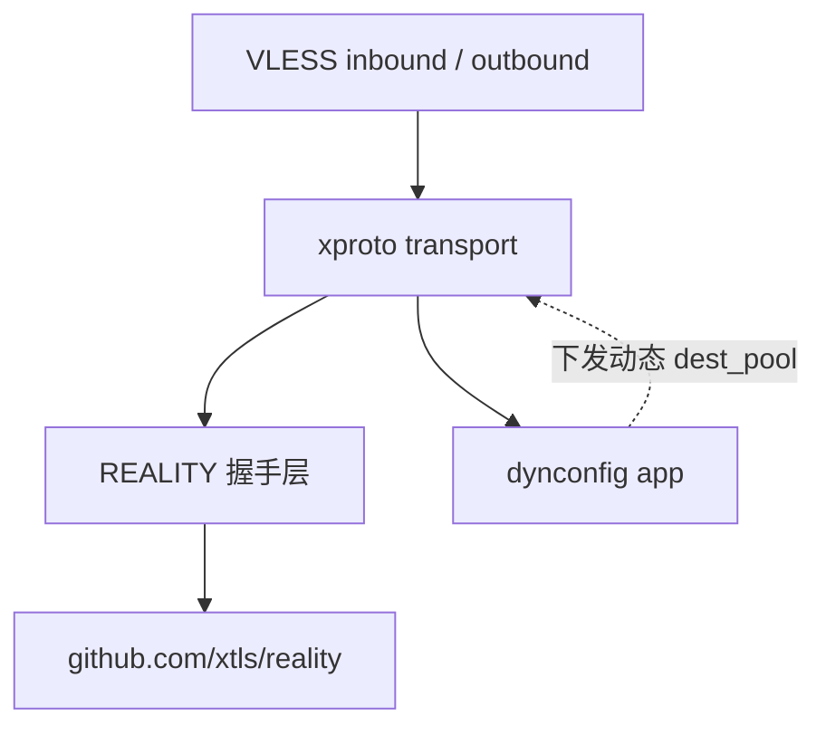
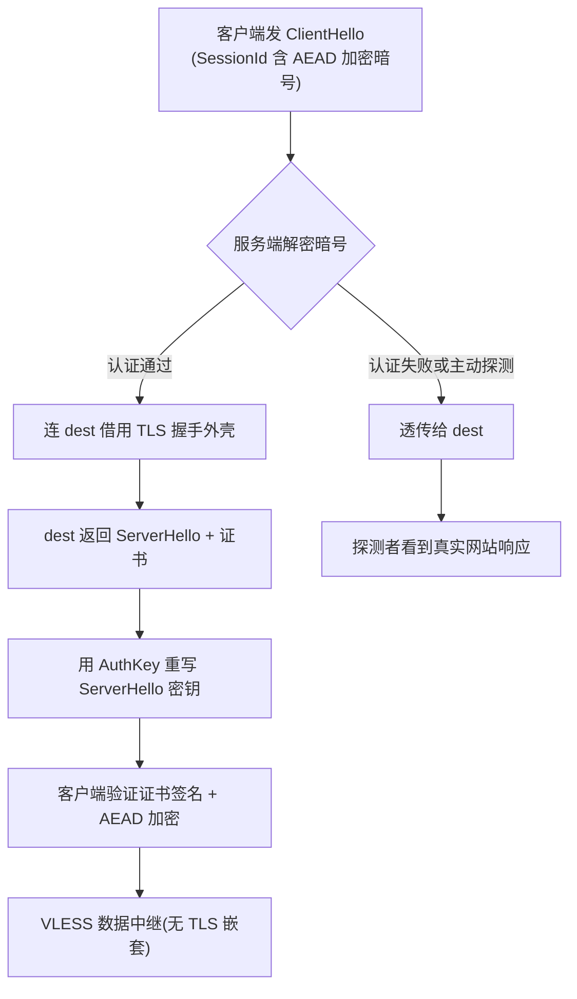
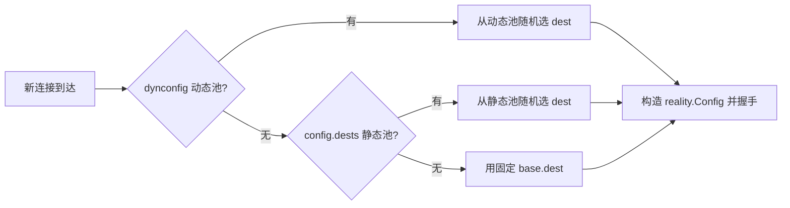
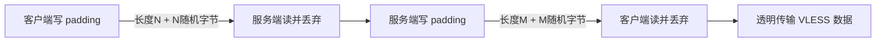
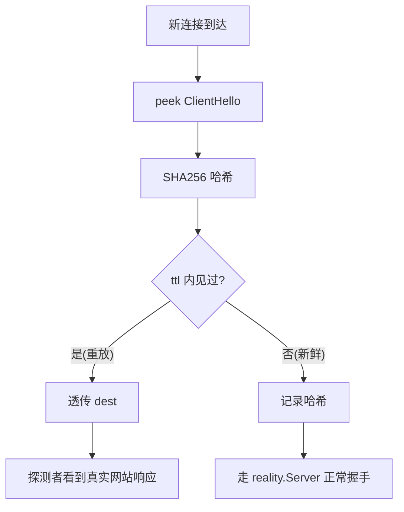

# xproto — 私有抗审查 Transport

> 基于 REALITY 改造的私有抗审查传输协议,作为 Xray-core 的独立 transport 实现。

## 简介

xproto 是一套基于 REALITY 握手机制改造的私有抗审查 transport。它将 REALITY 的握手安全层封装为独立 transport(`network: "xproto"`),而非传统的 security layer,避免侵入 tcp/splithttp/grpc 等现有 transport。

核心思路:**以 REALITY 为骨架(免域名/证书 + 反主动探测 + 无 TLS 嵌套),以参数动态化为免疫系统**。REALITY 握手层不 fork `github.com/xtls/reality`,仅在 transport wrapper 层做私有化扩展(dest 池、动态参数、握手 padding)。

设计原理详见仓库根目录 `notes/reality-vs-anytls.md` 第六章。

## 功能特性

| 功能 | 说明 |
|---|---|
| **REALITY 握手** | 借用真实 dest 网站的 TLS 握手外壳,认证暗号藏于 ClientHello SessionId;认证通过则劫持连接走自建 AEAD,认证失败则透传 dest(反主动探测) |
| **独立 transport** | 注册为 `network: "xproto"`,单一注册点,不侵入 tcp/splithttp/grpc |
| **dest 池** | 服务端配置多个 dest 候选,每连接随机选一个(私有化点,避免单 dest 被针对) |
| **dynconfig 动态参数** | dynconfig app 管理动态 dest_pool,通过 commander gRPC 运行时修改,无需重启 |
| **握手 padding shaper** | 握手后双向一次性随机长度 padding,打散首个应用包长度特征 |
| **防重放** | ClientHello SHA256 哈希去重,重放透传 dest(不暴露 REALITY 重写特征) |
| **免域名/证书** | 借真实 dest 证书,无需自持域名或证书 |

## 架构



**包结构**:
- `transport/internet/xproto/` — transport 实现(config / hub / dialer / shaper)
- `app/dynconfig/` — 动态参数 feature + commander service
- `features/extension/` — DynConfig 接口
- `infra/conf/` — JSON 配置(XprotoConfig / DynConfigConfig)

## 用法

### 1. 生成密钥

```bash
xray x25519
# 输出:
# PrivateKey: <服务端私钥>
# Password (PublicKey): <客户端公钥>
```

### 2. 服务端配置

```json
{
  "inbounds": [{
    "listen": "0.0.0.0",
    "port": 443,
    "protocol": "vless",
    "settings": {
      "clients": [{"id": "b831114c-7c89-4a01-a269-f5a8cdd0a6c4"}],
      "decryption": "none"
    },
    "streamSettings": {
      "network": "xproto",
      "xprotoSettings": {
        "dest": "www.cloudflare.com:443",
        "serverNames": ["www.cloudflare.com"],
        "privateKey": "<X25519 私钥 base64url>",
        "shortIds": ["0123456789abcdef"],
        "maxTimeDiff": 10000,
        "dests": ["www.cloudflare.com:443", "www.bing.com:443"],
        "padding": {"enabled": true, "minLen": 8, "maxLen": 16}
      }
    }
  }],
  "outbounds": [{"protocol": "freedom"}]
}
```

### 3. 客户端配置

```json
{
  "inbounds": [{
    "listen": "127.0.0.1",
    "port": 1080,
    "protocol": "socks",
    "settings": {"auth": "noauth", "udp": false}
  }],
  "outbounds": [{
    "protocol": "vless",
    "settings": {
      "vnext": [{
        "address": "<server_ip>",
        "port": 443,
        "users": [{"id": "b831114c-7c89-4a01-a269-f5a8cdd0a6c4", "encryption": "none"}]
      }]
    },
    "streamSettings": {
      "network": "xproto",
      "xprotoSettings": {
        "serverName": "www.cloudflare.com",
        "publicKey": "<X25519 公钥 base64url>",
        "shortId": "0123456789abcdef",
        "fingerprint": "chrome",
        "padding": {"enabled": true, "minLen": 8, "maxLen": 16}
      }
    }
  }]
}
```

### 4. dynconfig 动态参数(可选,服务端)

在顶层添加 `dynconfig` app 配置,dest_pool 运行时可通过 commander 修改:

```json
{
  "dynconfig": {
    "destPool": ["www.cloudflare.com:443", "www.bing.com:443"]
  }
}
```

commander gRPC 接口(运行时修改不重启):
- `GetDestPool` — 查询当前 dest 池
- `SetDestPool` — 替换 dest 池

### 字段说明

| 字段 | 端 | 说明 |
|---|---|---|
| `dest` | 服务端 | 固定 fallback dest(当 dests 为空时用) |
| `dests` | 服务端 | dest 池,每连接随机选一个 |
| `serverNames` | 服务端 | 允许的 SNI 列表 |
| `privateKey` | 服务端 | X25519 私钥 base64url |
| `shortIds` | 服务端 | 允许的 shortId 列表(hex) |
| `maxTimeDiff` | 服务端 | 时间戳容忍(毫秒,0 表示不校验);防重放 ttl = max(maxTimeDiff, 5min) |
| `serverName` | 客户端 | SNI |
| `publicKey` | 客户端 | X25519 公钥 base64url |
| `shortId` | 客户端 | 单个 shortId(hex) |
| `fingerprint` | 客户端 | uTLS 指纹(chrome / firefox / safari 等) |
| `padding` | 双端 | 握手 padding 配置(enabled / minLen / maxLen) |

## 机制原理

### 1. REALITY 握手(免域名 + 反主动探测)



**暗号机制**:客户端用 ECDH(临时私钥, 服务端公钥)算 AuthKey,经 HKDF 派生后用 AES-GCM 加密 ClientHello 的 SessionId 前 16 字节(内含版本号 / 时间戳 / ShortId)。服务端用私钥解密验证。握手后用 AuthKey 派生 AEAD 加密应用数据——**不存在 TLS 套 TLS 的双层嵌套**,因此不需要 anyTLS 那样的 padding 来对抗 TLS-in-TLS 检测。

**反主动探测**:认证不通过(审查者探测 / 无关流量)时,服务端把连接透明转发给真实 dest,探测者看到的是完全合法的真实网站握手与响应。

### 2. dest 池(私有化点 1)



优先级:**dynconfig 动态池 > 配置静态 dests > 固定 base.dest**。每连接独立选 dest,避免单一 dest 被针对或封禁导致整体失效。

### 3. dynconfig 动态参数(私有化点 2)

dynconfig 是一个 feature(`app/dynconfig`),持有运行时可改的 dest_pool。服务端 `hub.go` 通过 `core.FromContext(ctx).GetFeature(extension.DynConfigType())` 查询(可选,不存在则回退静态配置)。commander gRPC 暴露 `GetDestPool` / `SetDestPool`,可在运行时修改 dest 池而无需重启 xray 实例。

这是"参数动态化"的第一步落地——公开协议的参数是规范的一部分(静态),xproto 的参数是运行时数据(可变),即使客户端被逆向,审查者拿到的也只是过期快照。

### 4. 握手 padding shaper

REALITY 握手完成后、应用层(VLESS)数据之前,双方交换一次性随机长度 padding:



padding 长度在 `[minLen, maxLen]` 区间随机,用于打散首个应用包(VLESS 头 / 内层 TLS ClientHello)的长度特征。

> 持续流量整形(类似 anyTLS PaddingScheme 的逐包分片填充)需要会话层 framing,与 xproto 的透明传输设计冲突,因此留给 VLESS/Vision 层处理。xproto 的 shaper 只做握手后一次性 padding。

### 5. 防重放(nonce 去重)

审查者可能抓真客户端的 ClientHello 原样重放给服务端。若走 REALITY 劫持路径,重写的 ServerHello 与真 dest 响应不同,会暴露代理。防重放让重放走透传 dest 路径(响应同真网站):



**nonce 选择**:整个 ClientHello 字节的 SHA256(含 Random / key_share / SessionId 密文,每次连接都不同),绕开"时间戳秒级 + ShortId 不唯一"的问题。合法连接每次 ClientHello 不同,永不被误拒。

**重放处置 = 透传 dest**(不是关闭连接):关闭本身是异常行为会暴露;透传 dest 的响应和真网站一致。

**ttl** = `max(maxTimeDiff, 5min)`:ttl 内由 replayGuard 拦,ttl 外由 reality 时间校验拦。改 ClientHello 重放 → 哈希不命中放过,但 AEAD AD 变 → 暗号解密失败 → reality 透传(无害)。

**性能**:握手期 SHA256 ~500 字节 + map 查找(微秒级),稳态零开销。

## 端到端测试

本机起 server + client,验证全链路:

```bash
# 起服务端
xray run -c server.json &
# 起客户端
xray run -c client.json &
# 通过 SOCKS5 经 VLESS over xproto 访问外部
curl --socks5 127.0.0.1:1080 http://example.com/ -w "HTTP %{http_code}\n"
# HTTP 200
```

**注意事项**:
1. **dest 必须是支持 ML-KEM 的 TLS 站点**(如 cloudflare)。reality 借用 dest 的 TLS 握手外壳,chrome uTLS 指纹含 X25519MLKEM768 后量子 key_share,部分站点(microsoft / apple)的 TLS 不兼容(握手无法完成),本机 `openssl s_server` 也不支持 ML-KEM。
2. **freedom outbound 默认阻止 loopback 目标**(防 SSRF),端到端测试用外部目标(如 example.com)。
3. **DetectPostHandshakeRecordsLens**:reality 握手依赖 `GlobalPostHandshakeRecordsLens`(由该函数填充),xproto hub.go 会对池中每个 dest 启动检测。启动后需等待几秒让其完成首次检测,否则首轮握手会等待。

## 实现阶段

| 阶段 | 内容 | commit |
|---|---|---|
| MVP | 独立 transport 骨架,复用 REALITY 握手 | `db446cbe` |
| 阶段 2 | dest 池(嵌入 reality.Config + dests) | `07612a25` |
| 阶段 3 | dynconfig app(服务端动态 dest_pool + commander) | `3f49fdbe` |
| 阶段 4 | 握手 padding shaper | `abe10ec8` |
| 修复 | DetectPostHandshakeRecordsLens(握手卡死修复) | `761be2ef` |
| P1 | 防重放(ClientHello 哈希去重 + 透传 dest) | `63ae9f58` |

## 后续扩展

- **客户端动态 control stream**:阶段 3 只做服务端动态;客户端动态(publicKey / fingerprint 轮换)需 xproto 加 control 帧协议,会破坏 transport 透明性,留作后续。
- **密钥轮换 / 指纹轮换**:dynconfig 扩展 `server_keys` / `fingerprint_pool` 字段。
- **持续整形**:VLESS / Vision 层增强(可下发的 PaddingScheme)。

## 相关文档

- 设计原理:`notes/reality-vs-anytls.md` 第六章
- 实现计划:`.claude/plans/plan.md`
- REALITY 协议:https://github.com/XTLS/REALITY
- anyTLS 协议(对比):https://github.com/anytls/anytls-go
